FFTW
---------------------------------------------

CPU name: ``Intel(R) Xeon(R) CPU E5-2698 v4 @ 2.20GHz``.

Arch: ``X86_64``.

Core count: ``20``.

ISA extensions present: ``3dnowprefetch, abm, acpi, adx, aes, aperfmperf, apic, arat, arch_perfmon, avx, avx2, bmi1, bmi2, bts, cat_l3, cdp_l3, clflush, cmov, constant_tsc, cpuid, cpuid_fault, cqm, cqm_llc, cqm_mbm_local, cqm_mbm_total, cqm_occup_llc, cx16, cx8, dca, de, ds_cpl, dtes64, dtherm, dts, epb, ept, ept_ad, erms, est, f16c, flexpriority, flush_l1d, fma, fpu, fsgsbase, fxsr, hle, ht, ibpb, ibpb_exit_to_user, ibrs, ida, intel_ppin, intel_pt, invpcid, lahf_lm, lm, mca, mce, md_clear, mmx, monitor, movbe, msr, mtrr, nonstop_tsc, nopl, nx, osxsave, pae, pat, pbe, pcid, pclmulqdq, pdcm, pdpe1gb, pebs, pge, pln, pni, popcnt, pqe, pqm, pse, pse36, pti, pts, rdrand, rdrnd, rdseed, rdt_a, rdtscp, rep_good, rtm, sdbg, sep, smap, smep, smx, ss, ssbd, sse, sse2, sse4_1, sse4_2, ssse3, stibp, syscall, tm, tm2, tpr_shadow, tsc, tsc_adjust, tsc_deadline_timer, tscdeadline, vme, vmx, vnmi, vpid, x2apic, xsave, xsaveopt, xtopology, xtpr``.

Compiler version: ``c++ (Ubuntu 13.3.0-6ubuntu2~24.04.1) 13.3.0``.

Compiler flags: ``-march=native``.

1D Transforms
~~~~~~~~~~~~~~~~~~~~~~~~~~~~~~~~~~~~~~~~~~~~~

Type 1
^^^^^^^^^^^^^^^^^^^^^^^^^^^^^^^^^^^^^^^^^^^^^

Parameters: ``prec:f N1:10000.0 N2:1 N3:1
ntransf:1 threads:1 M:10000000.0 tol:0.0001``

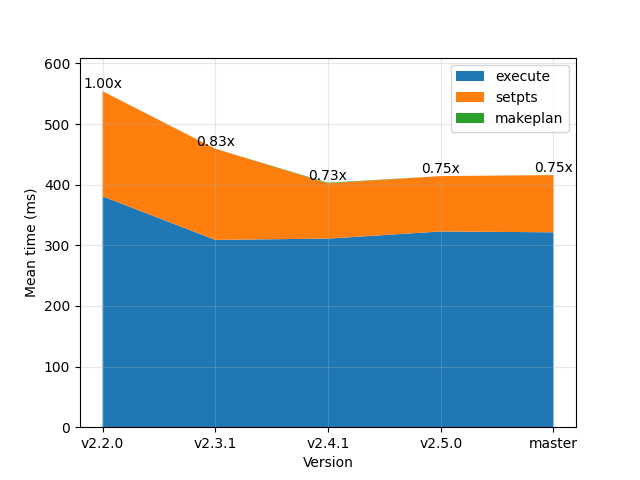

Parameters: ``prec:d N1:10000.0 N2:1 N3:1
ntransf:1 threads:1 M:10000000.0 tol:1e-09``

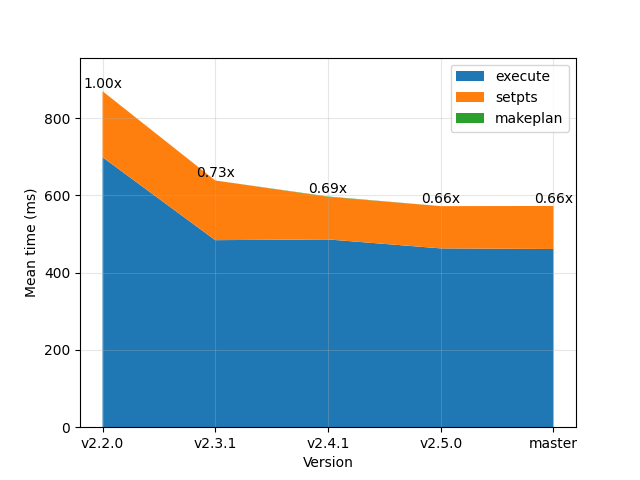

Type 2
^^^^^^^^^^^^^^^^^^^^^^^^^^^^^^^^^^^^^^^^^^^^^

Parameters: ``prec:f N1:10000.0 N2:1 N3:1
ntransf:1 threads:1 M:10000000.0 tol:0.0001``

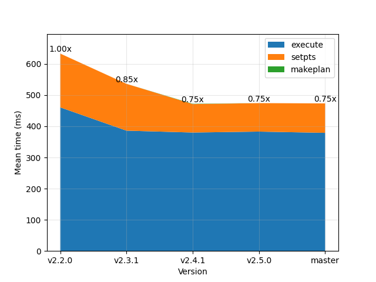

Parameters: ``prec:d N1:10000.0 N2:1 N3:1
ntransf:1 threads:1 M:10000000.0 tol:1e-09``

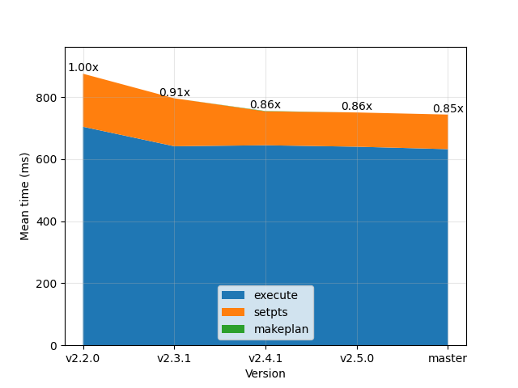

Type 3
^^^^^^^^^^^^^^^^^^^^^^^^^^^^^^^^^^^^^^^^^^^^^

Parameters: ``prec:f N1:10000.0 N2:1 N3:1
ntransf:1 threads:1 M:10000000.0 tol:0.0001``

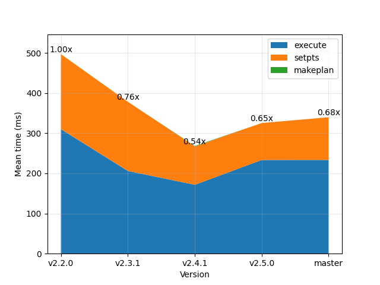

Parameters: ``prec:d N1:10000.0 N2:1 N3:1
ntransf:1 threads:1 M:10000000.0 tol:1e-09``

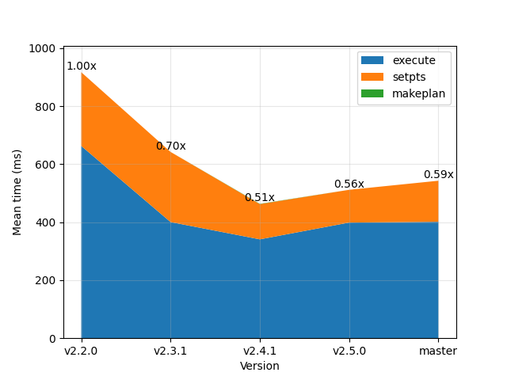

2D Transforms
~~~~~~~~~~~~~~~~~~~~~~~~~~~~~~~~~~~~~~~~~~~~~

Type 1
^^^^^^^^^^^^^^^^^^^^^^^^^^^^^^^^^^^^^^^^^^^^^

Parameters: ``prec:f N1:320 N2:320 N3:1
ntransf:1 threads:1 M:10000000.0 tol:1e-05``

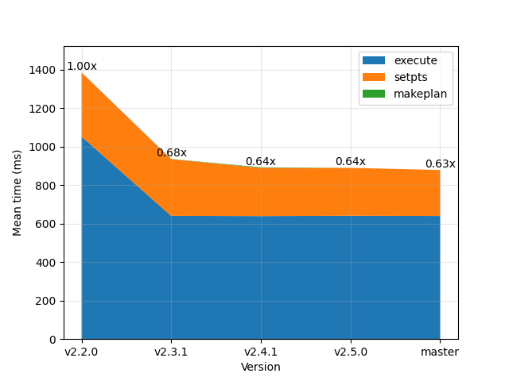

Parameters: ``prec:d N1:320 N2:320 N3:1
ntransf:1 threads:1 M:10000000.0 tol:1e-09``

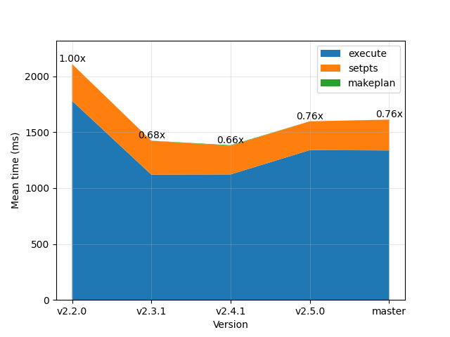

Parameters: ``prec:f N1:320 N2:320 N3:1
ntransf:1 threads:0 M:10000000.0 tol:1e-05``

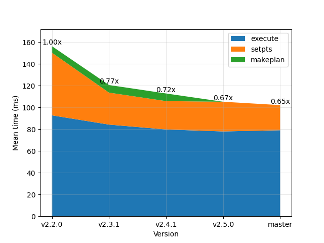

Type 2
^^^^^^^^^^^^^^^^^^^^^^^^^^^^^^^^^^^^^^^^^^^^^

Parameters: ``prec:f N1:320 N2:320 N3:1
ntransf:1 threads:1 M:10000000.0 tol:1e-05``

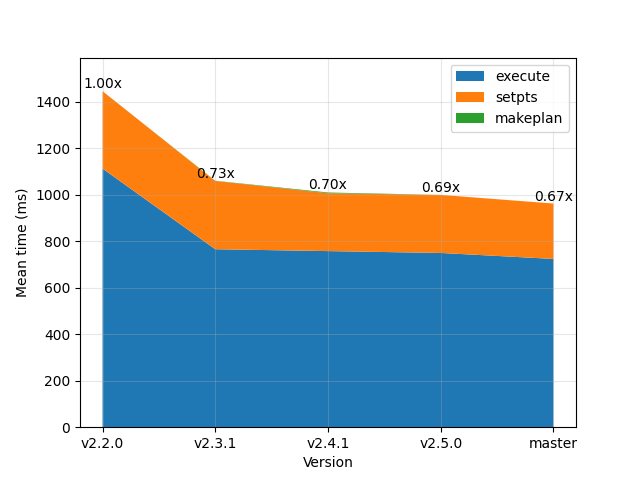

Parameters: ``prec:d N1:320 N2:320 N3:1
ntransf:1 threads:1 M:10000000.0 tol:1e-09``

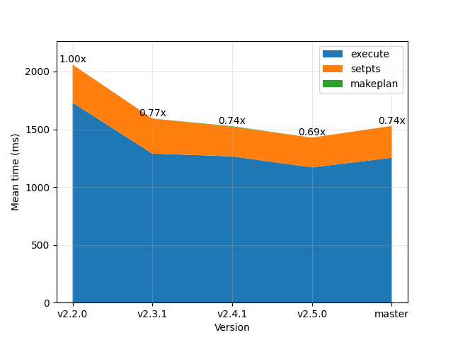

Parameters: ``prec:f N1:320 N2:320 N3:1
ntransf:1 threads:0 M:10000000.0 tol:1e-05``

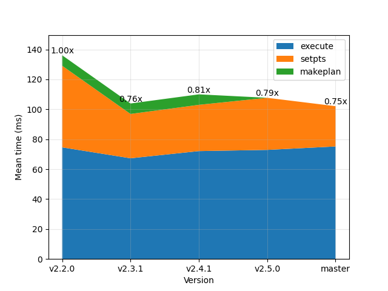

Type 3
^^^^^^^^^^^^^^^^^^^^^^^^^^^^^^^^^^^^^^^^^^^^^

Parameters: ``prec:f N1:320 N2:320 N3:1
ntransf:1 threads:1 M:10000000.0 tol:1e-05``

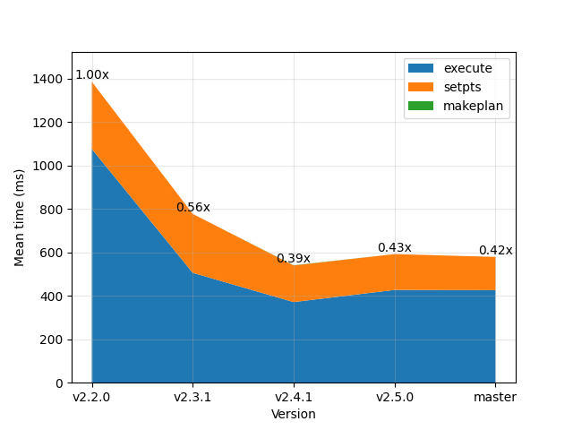

Parameters: ``prec:d N1:320 N2:320 N3:1
ntransf:1 threads:1 M:10000000.0 tol:1e-09``

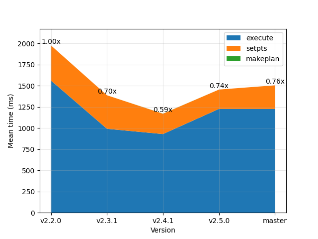

Parameters: ``prec:f N1:320 N2:320 N3:1
ntransf:1 threads:0 M:10000000.0 tol:1e-05``

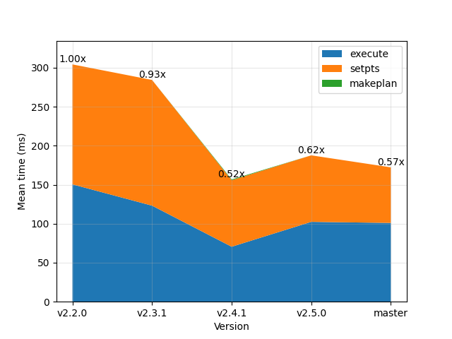

3D Transforms
~~~~~~~~~~~~~~~~~~~~~~~~~~~~~~~~~~~~~~~~~~~~~

Type 1
^^^^^^^^^^^^^^^^^^^^^^^^^^^^^^^^^^^^^^^^^^^^^

Parameters: ``prec:d N1:192 N2:192 N3:128
ntransf:1 threads:0 M:10000000.0 tol:1e-07``

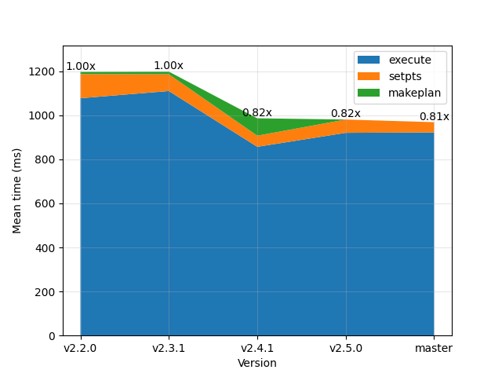

Type 2
^^^^^^^^^^^^^^^^^^^^^^^^^^^^^^^^^^^^^^^^^^^^^

Parameters: ``prec:d N1:192 N2:192 N3:128
ntransf:1 threads:0 M:10000000.0 tol:1e-07``

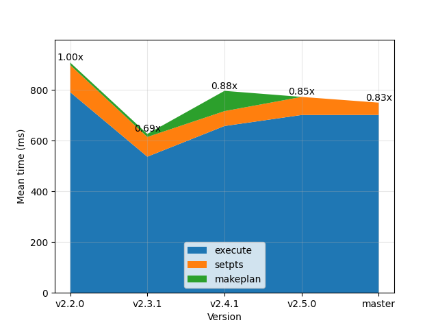

Type 3
^^^^^^^^^^^^^^^^^^^^^^^^^^^^^^^^^^^^^^^^^^^^^

Parameters: ``prec:d N1:192 N2:192 N3:128
ntransf:1 threads:0 M:10000000.0 tol:1e-07``

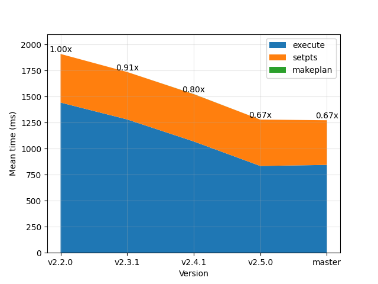

