.. _perftest_timings:

Performance regression
========================

This page compares performance of every FINUFFT release version and latest commit on master.

The CPU used for all benchmarks below is: Intel(R) Xeon(R) CPU E5-2698 v4 @ 2.20GHz

AVX extensions present: avx, avx2.

FMA supported: yes.

1D Transforms
---------------------------------------------

Type 3
~~~~~~~~~~~~~~~~~~~~~~~~~~~~~~~~~~~~~~~~~~~~~

Parameters: ``prec:f N1:10000.0 N2:1 N3:1
ntransf:1 threads:1 M:10000000.0 tol:0.0001``

Parameters: ``prec:d N1:10000.0 N2:1 N3:1
ntransf:1 threads:1 M:10000000.0 tol:1e-09``

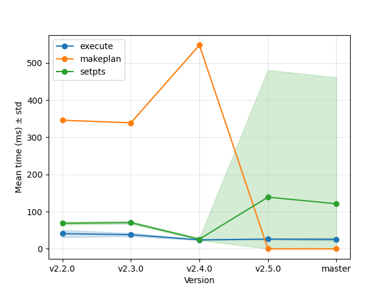

Type 2
~~~~~~~~~~~~~~~~~~~~~~~~~~~~~~~~~~~~~~~~~~~~~

Parameters: ``prec:f N1:10000.0 N2:1 N3:1
ntransf:1 threads:1 M:10000000.0 tol:0.0001``

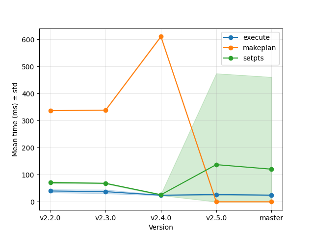

Parameters: ``prec:d N1:10000.0 N2:1 N3:1
ntransf:1 threads:1 M:10000000.0 tol:1e-09``

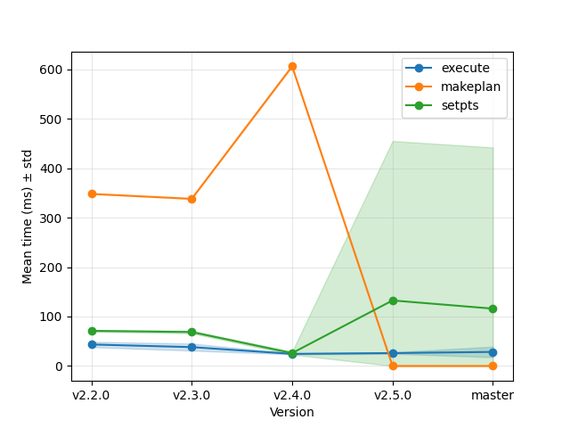

Type 1
~~~~~~~~~~~~~~~~~~~~~~~~~~~~~~~~~~~~~~~~~~~~~

Parameters: ``prec:f N1:10000.0 N2:1 N3:1
ntransf:1 threads:1 M:10000000.0 tol:0.0001``

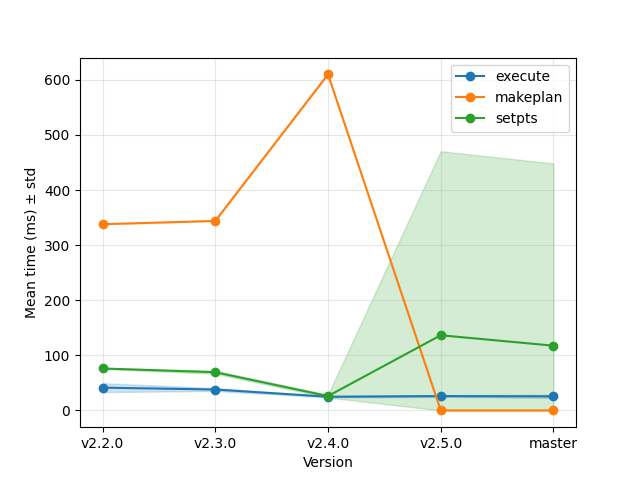

Parameters: ``prec:d N1:10000.0 N2:1 N3:1
ntransf:1 threads:1 M:10000000.0 tol:1e-09``

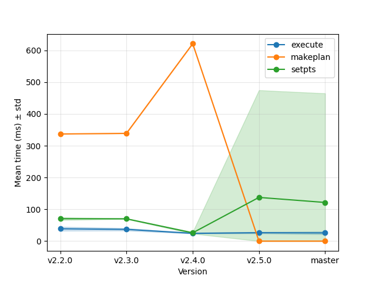

2D Transforms
---------------------------------------------

Type 3
~~~~~~~~~~~~~~~~~~~~~~~~~~~~~~~~~~~~~~~~~~~~~

Parameters: ``prec:f N1:320 N2:320 N3:1
ntransf:1 threads:1 M:10000000.0 tol:1e-05``

Parameters: ``prec:d N1:320 N2:320 N3:1
ntransf:1 threads:1 M:10000000.0 tol:1e-09``

Parameters: ``prec:f N1:320 N2:320 N3:1
ntransf:1 threads:0 M:10000000.0 tol:1e-05``

Type 2
~~~~~~~~~~~~~~~~~~~~~~~~~~~~~~~~~~~~~~~~~~~~~

Parameters: ``prec:f N1:320 N2:320 N3:1
ntransf:1 threads:1 M:10000000.0 tol:1e-05``

Parameters: ``prec:d N1:320 N2:320 N3:1
ntransf:1 threads:1 M:10000000.0 tol:1e-09``

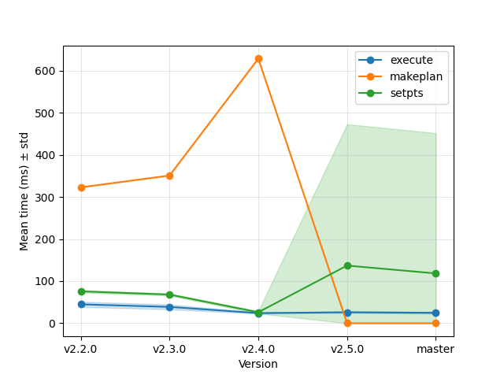

Parameters: ``prec:f N1:320 N2:320 N3:1
ntransf:1 threads:0 M:10000000.0 tol:1e-05``

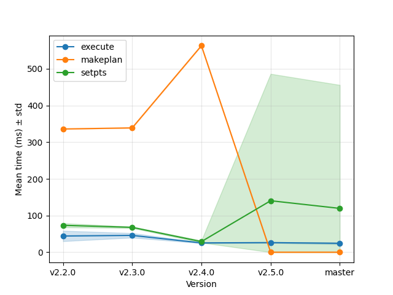

Type 1
~~~~~~~~~~~~~~~~~~~~~~~~~~~~~~~~~~~~~~~~~~~~~

Parameters: ``prec:f N1:320 N2:320 N3:1
ntransf:1 threads:1 M:10000000.0 tol:1e-05``

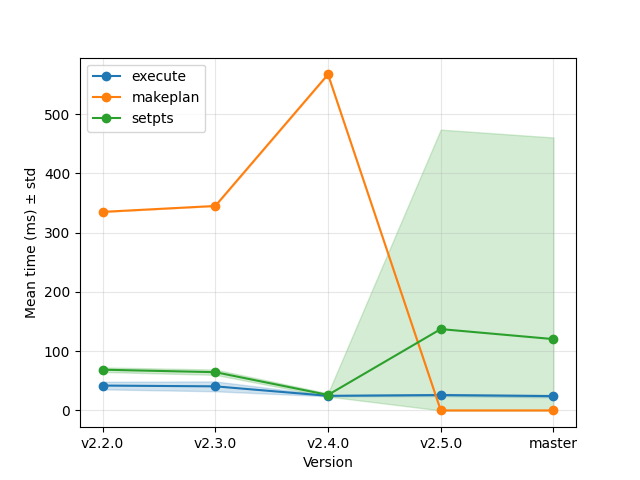

Parameters: ``prec:d N1:320 N2:320 N3:1
ntransf:1 threads:1 M:10000000.0 tol:1e-09``

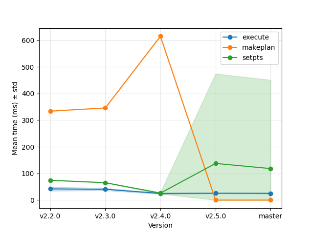

Parameters: ``prec:f N1:320 N2:320 N3:1
ntransf:1 threads:0 M:10000000.0 tol:1e-05``

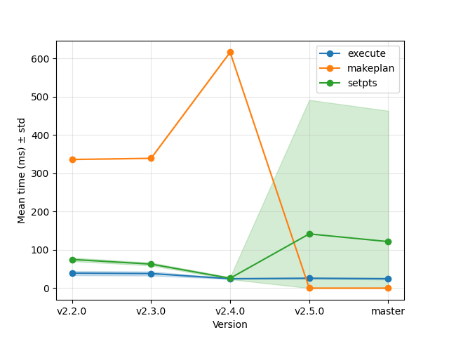

3D Transforms
---------------------------------------------

Type 3
~~~~~~~~~~~~~~~~~~~~~~~~~~~~~~~~~~~~~~~~~~~~~

Parameters: ``prec:d N1:192 N2:192 N3:128
ntransf:1 threads:0 M:10000000.0 tol:1e-07``

Type 2
~~~~~~~~~~~~~~~~~~~~~~~~~~~~~~~~~~~~~~~~~~~~~

Parameters: ``prec:d N1:192 N2:192 N3:128
ntransf:1 threads:0 M:10000000.0 tol:1e-07``

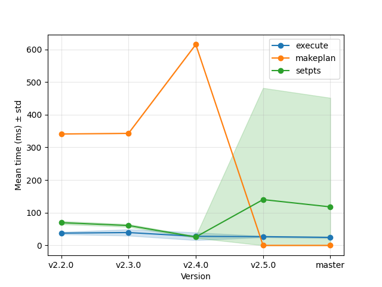

Type 1
~~~~~~~~~~~~~~~~~~~~~~~~~~~~~~~~~~~~~~~~~~~~~

Parameters: ``prec:d N1:192 N2:192 N3:128
ntransf:1 threads:0 M:10000000.0 tol:1e-07``

